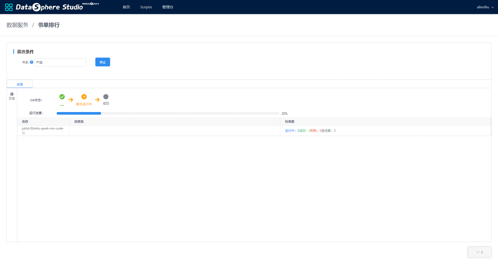
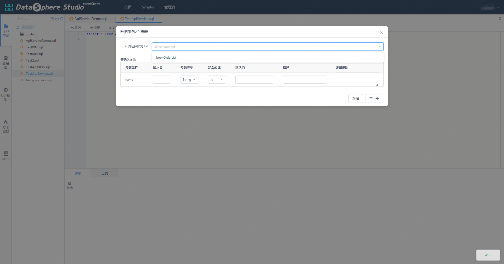

Data Service
----------

&nbsp;&nbsp;&nbsp;&nbsp;&nbsp;&nbsp;&nbsp;&nbsp;DSS currently supports publishing SQL scripts as data service APIs and sharing them with other users. Business users can execute data service scripts and browse or download platform data directly by setting parameters without writing code and without big data platform users.
Data service is a kind of service provided to users who do not have database table permission for users with database table permission. This article will focus on publishing data service users (referred to as publishing users) and using data service users (referred to as using users) from two different perspectives. Be explained.
Due to business needs, the use of data services will have the following restrictions:
* Only supports Spark SQL queries
* Multiple result set queries are not supported
* Only supports query SELECT statement
* can only contain one SQL statement
* Semicolons are not allowed at the end of SQL statements

&nbsp;&nbsp;&nbsp;&nbsp;&nbsp;&nbsp;&nbsp;&nbsp;In addition to the above restrictions, the following notation is allowed.
```sql
USE DATABASE default;
SELECT * FROM default.book
```

**1. Create a data service**

&nbsp;&nbsp;&nbsp;&nbsp;&nbsp;&nbsp;&nbsp;&nbsp;Due to business needs, it is necessary to establish a data service and authorize others to use it. When the publishing user enters Scriptis, edits the new script file, writes Spark SQL statements, and embeds variables in the SQL statements, which is convenient for subsequent business personnel to set parameters by themselves. data can be obtained.
&nbsp;&nbsp;&nbsp;&nbsp;&nbsp;&nbsp;&nbsp;&nbsp;After saving the Spark SQL script, you can click "Publish as Data API" at the top of the script editing bar (the "Publish as Data API" function, only some users have this permission, and the function button is not visible for users who do not have permission. ), fill in the new API information as shown in the figure below.


Click Next for information on setting variables.


Publishing users can use the data service on the homepage of the workspace, through the application tool, enter the "Data Service" application to use the data service, and click "More" on the data service tab to enter the data service management interface


**2. Use of data services**

&nbsp;&nbsp;&nbsp;&nbsp;&nbsp;&nbsp;&nbsp;&nbsp;After entering the data service page, you can see the data service list page that the user can use, where default means all data services by default, the user can click the corresponding The label filters out the data services you need to use, and you can filter by name, status, and submitter in the search box.

&nbsp;&nbsp;&nbsp;&nbsp;&nbsp;&nbsp;&nbsp;&nbsp;Users can click "Enter Use" to set the value of parameters in the filter conditions. The user is a subset of the published user data set.



**3. Modify data service**

&nbsp;&nbsp;&nbsp;&nbsp;&nbsp;&nbsp;&nbsp;&nbsp;A data service may be modified due to business needs. When the publishing user has modified the script of the data service, he can click "Update Data API".
To update the data service, you can select other data services to be bound.


**4. Use postman to access data services**

After the data service is released, it can be accessed using the api interface, which can be called directly to other systems. Submit a query as shown below:


The task execution ID is obtained, and then the task execution progress, log, result set, etc. can be obtained according to the ID.


Description: The token of the data service can be returned from the /queryById? interface (click to use it), and the field is userToken. Access to all interfaces must be authenticated by GateWay. The token of the data service can only be used for the management process of the data service. Authentication using postman requires the use of the cookie of the page and the key authentication method of linkis-gateway. In the head, add Token-Code: XXX here to specify the login key of linkis-gateway Token-User: XXX here to specify the login user of linkis-gateway.

