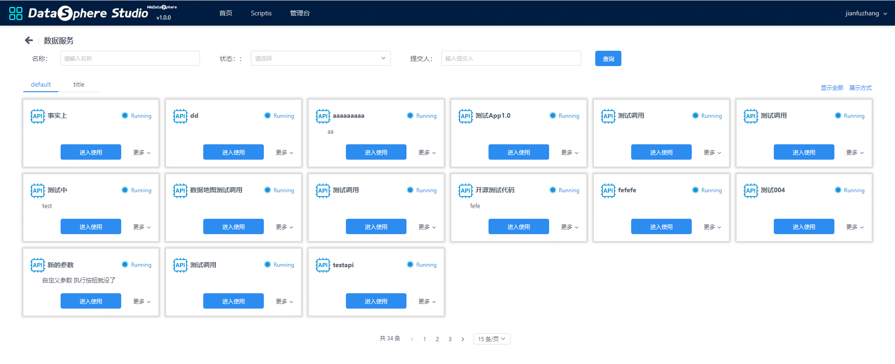
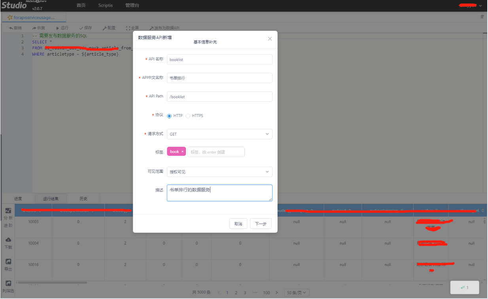
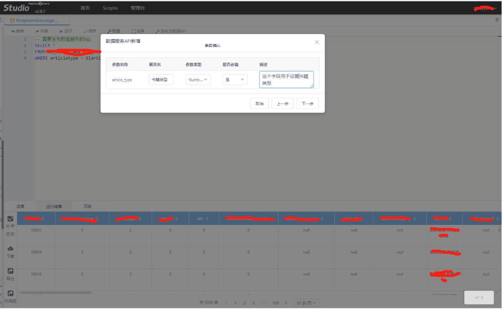
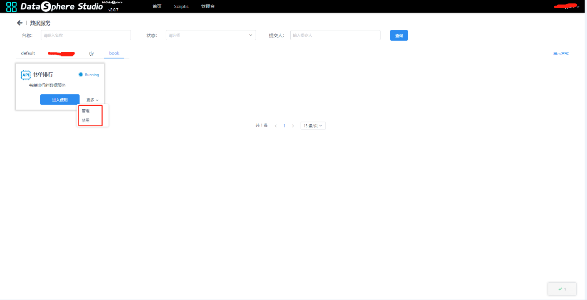
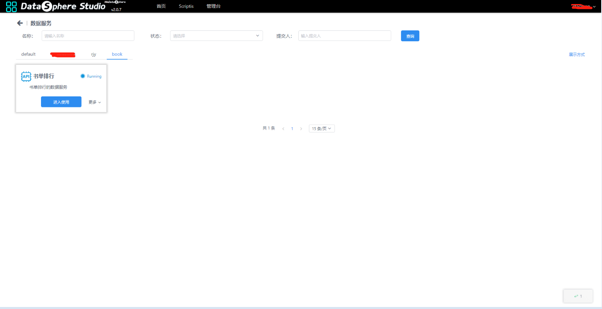
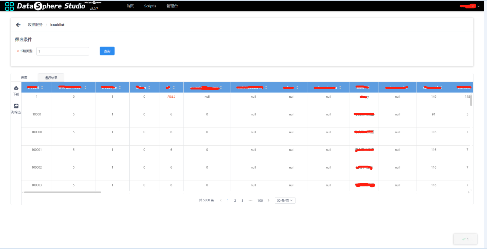
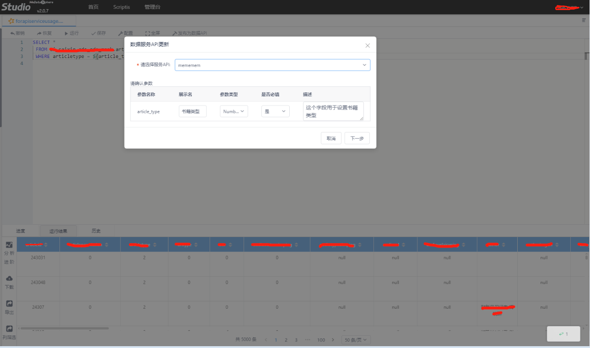
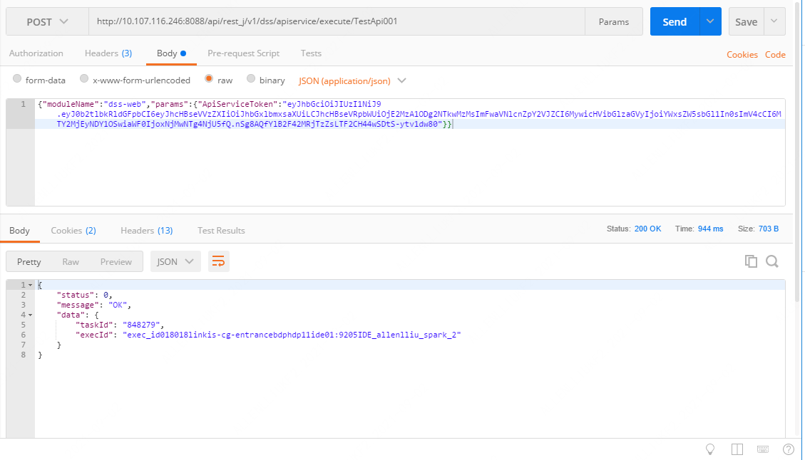

data service
----------

DSS currently supports publishing SQL scripts as data service APIs and sharing them with other users. Business users can execute data service scripts and browse or download platform data directly by setting parameters without writing code and without big data platform users.

**1、Create a data service**

Due to business needs, a data service needs to be established and authorized to be used by others. When the publishing user enters Scriptis, edits the new script file, writes SQL statements, and at the same time can embed variables in SQL statements, which is convenient for subsequent business personnel to set parameters by themselves. data can be obtained.

After saving the Spark SQL script, you can click "Publish as Data API" at the top of the script editing bar (the "Publish as Data API" function, only some users have this permission, users who do not have the permission, the function button is not visible ), after clicking, you need to fill in the following API creation information (with red
\* marked as required), fill in the new API information as shown in the figure below.

Click Next for information on setting variables.

Publishing users can enter the use of data services on the homepage of the workspace through "Enter Data Service Development" and "More Application Tools", and click "More" on the Data Service tab to enter the data service management interface.

**2、Use data services**

After entering the data service page, you can see the list of data services that the user can use, where default means all data services by default. , filter by name, status, and submitter respectively. The details page is shown in the figure below.

The user clicks "Enter Use" to set the value of the parameter in the filter condition. It can be seen that the user is a subset of the published user data set.

**3、Modify data service**

A data service may be modified due to business needs. When the publishing user modifies the script of the data service, he can click "Update Data API".
To update the data service, you can select other data services to be bound.

**4、Access data services using postman**

After the data service is released, it can be accessed using the api interface, which can be called directly to other systems. Submit a query as shown below:

The task execution ID is obtained, and then the task execution progress, log, result set, etc. can be obtained according to the ID.

Description: The token of the data service can be returned from the /queryById? interface (click to enter to use), and the field is userToken. Access to all interfaces must be authenticated by GateWay. The token of the data service can only be used for the management process of the data service. Authentication using postman requires the use of the cookie of the page and the key authentication method of linkis-gateway. In the head, add Token-Code: XXX here to specify the login key of linkis-gateway Token-User: XXX here to specify the login user of linkis-gateway.

