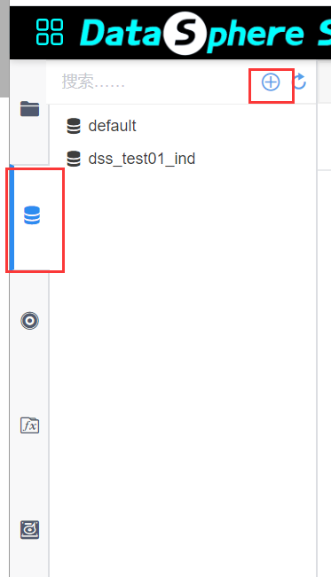
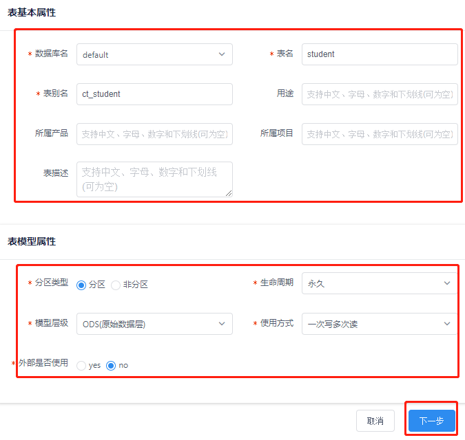
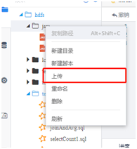
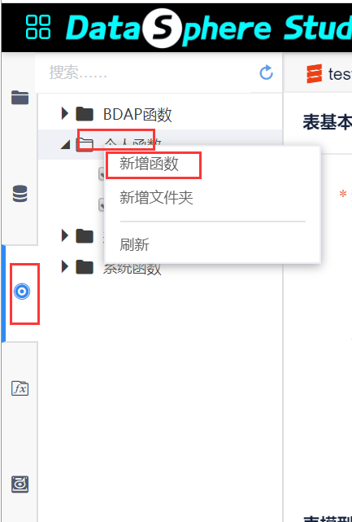
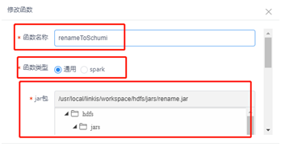
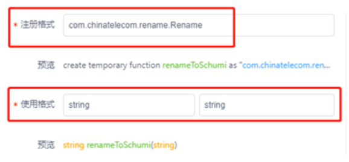

# DSS User Test Example 2：Hive

The purpose of DSS user test samples is to provide a set of test samples for new users of the platform to familiarize themselves with the common operations of DSS and to verify the correctness of the DSS platform


## 2.1 Data warehouse building table

Enter the "Database" page, click "+", enter the table information, table structure and partition information in turn to create a database table:



                        

Through the above process, create the department table dept, the employee table emp and the partitioned employee table emp_partition respectively. The table creation statement is as follows:

```iso92-sql
create external table if not exists default.dept(
    deptno int,
    dname string,
    loc int
)
row format delimited fields terminated by '\t';

create external table if not exists default.emp(
    empno int,
    ename string,
    job string,
    mgr int,
    hiredate string, 
    sal double, 
    comm double,
    deptno int
)
row format delimited fields terminated by '\t';

create table if not exists emp_partition(
    empno int,
    ename string,
    job string,
    mgr int,
    hiredate string, 
    sal double, 
    comm double,
    deptno int
)
partitioned by (month string)
row format delimited fields terminated by '\t';
```

**Import Data**

Currently, data needs to be manually imported in batches through the background, and data can be inserted from the page through the insert method

```sql
load data local inpath 'dept.txt' into table default.dept;
load data local inpath 'emp.txt' into table default.emp;
load data local inpath 'emp1.txt' into table default.emp_partition;
load data local inpath 'emp2.txt' into table default.emp_partition;
load data local inpath 'emp2.txt' into table default.emp_partition;
```

Other data is imported according to the above statement. The path of the sample data file is: `examples\ch3`

## 2.2 Basic SQL syntax test

### 2.2.1 Simple query

```sql
select * from dept;
```

### 2.2.2 Join connection

```sql
select * from emp
left join dept
on emp.deptno = dept.deptno;
```

### 2.2.3 Aggregate function

```sql
select dept.dname, avg(sal) as avg_salary
from emp left join dept
on emp.deptno = dept.deptno
group by dept.dname;
```

### 2.2.4 built-in function

```sql
select ename, job,sal,
rank() over(partition by job order by sal desc) sal_rank
from emp;
```

### 2.2.5 Partitioned table simple query

```sql
show partitions emp_partition;
select * from emp_partition where month='202001';
```

### 2.2.6 Partitioned table union query

```sql
select * from emp_partition where month='202001'
union
select * from emp_partition where month='202002'
union
select * from emp_partition where month='202003'
```

## 2.3 UDF function test

### 2.3.1 Jar package upload

After entering the Scriptis page, right-click the directory path to upload the jar package:

                  

The test example jar is in `examples\ch3\rename.jar`   

### 4.3.2 custom function

Enter the "UDF Function" option (such as 1), right-click the "Personal Function" directory, and select "Add Function":



Enter the function name, select the jar package, and fill in the registration format and input and output format to create a function:

             



The obtained function is as follows:

              

### 4.3.3 SQL query with custom function

After completing the function registration, you can enter the workspace page to create a .hql file to use the function:

```sql
select deptno,ename, rename(ename) as new_name
from emp;
```
