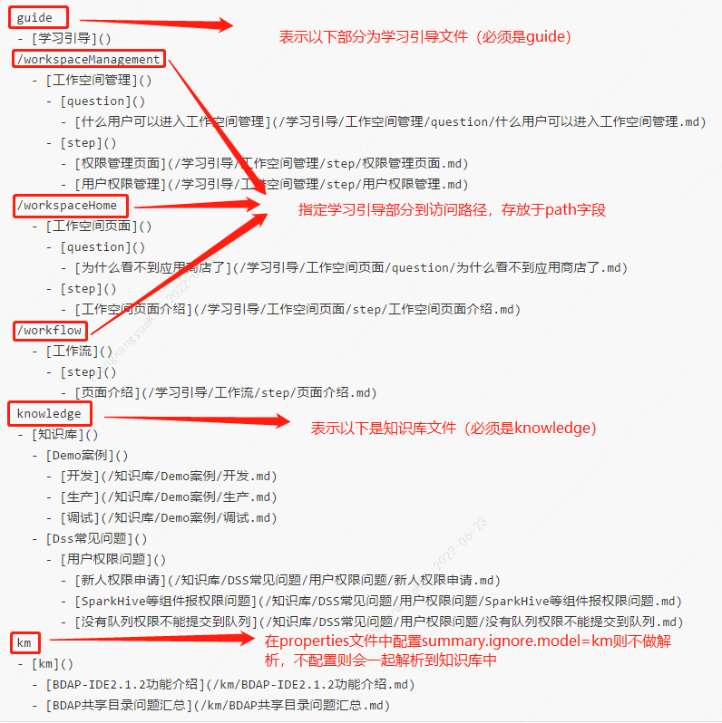

# 帮助文档部署文档

> 简介:帮助文档模块属于dss-user-guide模块下，用于提供dss项目相关资料。

&nbsp;&nbsp;&nbsp;&nbsp;&nbsp;&nbsp;&nbsp;&nbsp;在使用dss-user-guide模块时需先部署dss项目服务，可参考dss部署相关文档，dss-user-guide文档同步功能采用定时任务没两小时同步一次，文档更新到系统需要维护一份SUMMARY.md文件用于user-guide模块解析文件所在位置，及解析文档内容。


## 1、dss-guide-server.properties知识库相关配置说明

### 1.1 参考配置

````properties
#gitbook
#文档所存放的服务器ip地址
target.ip.address=127.0.0.1
#文档所在服务器路径
host.gitbook.path=/appcom/Install/ApacheInstall/gitbook_books
#需要同步到服务器
target.gitbook.path=/appcom/Install/ApacheInstall
#用于忽略解析km下到目录
summary.ignore.model=km
#知识库同步方式：gitbook database
guide.sync.model=gitbook
````

### 1.2 DSS1.1.0配置

````properties
#gitbook
#文档所存放的服务器ip地址
target.ip.address=127.0.0.1
#文档所在服务器路径(目录配置到summary.md文件所在目录即可，例：/xxx/test1/SUMMARY.md)
host.gitbook.path=/xxx/test1
#Dss1.1.0不支持gitbook方式同步，故采取database
guide.sync.model=gitbook
````


## 2、SUMMARY.md文件结构说明

&nbsp;&nbsp;&nbsp;&nbsp;&nbsp;&nbsp;&nbsp;&nbsp;SUMMARY.md文件主要用于维护文件所在位置及文件解析之后文件到层级结构

**例：**

````SUMMARY.md
guide
- [学习引导]()
/workspaceManagement
  - [工作空间管理]()
    - [question]()
      - [什么用户可以进入工作空间管理](/学习引导/工作空间管理/question/什么用户可以进入工作空间管理.md)
    - [step]()
      - [权限管理页面](/学习引导/工作空间管理/step/权限管理页面.md)
      - [用户权限管理](/学习引导/工作空间管理/step/用户权限管理.md)
/workspaceHome
  - [工作空间页面]()
    - [question]()
      - [为什么看不到应用商店了](/学习引导/工作空间页面/question/为什么看不到应用商店了.md)
    - [step]()
      - [工作空间页面介绍](/学习引导/工作空间页面/step/工作空间页面介绍.md)
/workflow
  - [工作流]()
    - [step]()
      - [页面介绍](/学习引导/工作流/step/页面介绍.md)
knowledge
- [知识库]()
  - [Demo案例]()
    - [开发](/知识库/Demo案例/开发.md)
    - [生产](/知识库/Demo案例/生产.md)
    - [调试](/知识库/Demo案例/调试.md)
  - [Dss常见问题]()
    - [用户权限问题]()
      - [新人权限申请](/知识库/DSS常见问题/用户权限问题/新人权限申请.md)
      - [SparkHive等组件报权限问题](/知识库/DSS常见问题/用户权限问题/SparkHive等组件报权限问题.md)   
      - [没有队列权限不能提交到队列](/知识库/DSS常见问题/用户权限问题/没有队列权限不能提交到队列.md)
km
- [km]()
  - [BDAP-IDE2.1.2功能介绍](/km/BDAP-IDE2.1.2功能介绍.md)
  - [BDAP共享目录问题汇总](/km/BDAP共享目录问题汇总.md)
````

**说明：**



**目录结构说明：**

- “-” + “空格” + “[内容]” + "()" 表示一级目录
- “空格” + “空格” + “-” + “空格” + “[内容]” + "()" 表示二级目录
- “空格” + “空格” + “空格” + “空格” + “-” + “空格” + “[内容]” + "()" 表示三级目录
- “空格” + “空格” + “空格” + “空格” + “空格” + “空格” + “-” + “空格” + “[内容]” + "()" 表示四级目录

**注：()中放文件到相对路径，并且文件名不能含有英文字符的()**


## 3.文件图片说明及配置

&nbsp;&nbsp;&nbsp;&nbsp;&nbsp;&nbsp;&nbsp;&nbsp;由于部分文档会存在插图，md文件被user-guide模块解析后会将其内容存放到数据库中，图片存放到数据库的只是图片到路径，故在md文档中插入图片的时候需要存放文件到相对路径，然后通过nginx代理到服务器图片存放的文件夹即可。

文件目录结构如下：(假设文件存放子服务器/xxx/test1目录下)

├── 这是一个例子而已.md <br>
│   ├── images  <br>
│   │   └── 1.png <br>
├──  SUMMARY.md  <br>

**例：**

````md
这是一个例子而已！！！
下面是图片

````

**nginx配置：**

````nginx
# 图片所在服务器路径
location /images {
   root /xxx/test1/;
   autoindex on;
}        
````

**注：这段配置需加在dss服务所在到nginx配置中，需要保证图片到ip:port有服务器一致。**

&nbsp;&nbsp;&nbsp;&nbsp;&nbsp;&nbsp;&nbsp;&nbsp;配置完成之后重启服务即可将文件同步到user-guide中！


