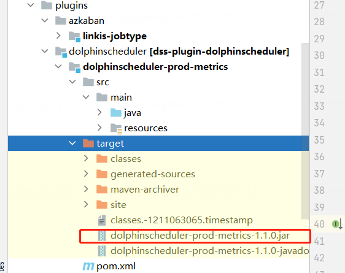

# DolphinSchedulerAppConn 安装文档

## 1. 准备工作

您在部署 `DolphinSchedulerAppConn` 之前，必须先将 `DolphinScheduler` 部署启动并保证 `DolphinScheduler` 可用。

**请注意：目前 `DolphinSchedulerAppConn` 只支持适配 DolphinScheduler1.3.X。**

关于 `DolphinScheduler` 的安装部署，请参考：`DolphinScheduler` [安装部署文档](https://dolphinscheduler.apache.org/zh-cn/docs/1.3.8/user_doc/standalone-deployment.html)

## 2. 下载和编译

`DolphinSchedulerAppConn` 插件安装包，可从此处下载：[点我下载插件安装包](https://osp-1257653870.cos.ap-guangzhou.myqcloud.com/WeDatasphere/DolphinScheduler/dolphinscheduler-appconn.zip)

如果您想自己编译 `DolphinSchedulerAppConn`，具体编译步骤如下:

1. clone DataSphereStudio 的代码

2. 单独编译 dss-dolphinscheduler-appconn

```shell script 
 cd ${DSS_HOME}/dss-appconn/appconns/dss-dolphinscheduler-appconn
 mvn clean install
```
3. 在dss-dolphinscheduler-appconn/target/out目录下会生成dolphinscheduler文件夹，用户将其压缩成dolphinscheduler-appconn.zip文件即可

## 3. 配置和部署

### 3.1 appconn配置与安装
- 将 `dolphinscheduler-appconn.zip` 插件安装包，放置到如下目录并进行解压。

```shell script 
 cd ${DSS_HOME}/dss/dss-appconns
 unzip dolphinscheduler-appconn.zip
```

- 配置参数，请按需修改 `appconn.properties` 的配置参数。

```shell script
 cd ${DSS_HOME}/dss/dss-appconns/dolphinscheduler
 vim appconn.properties
```

```properties
# 【必填】指定 DolphinScheduler 的管理员用户
wds.dss.appconn.ds.admin.user=admin
# 【必填】指定 DolphinScheduler 管理员用户的 token，可从dolphinscheduler页面的"安全中心->令牌管理"处中得到
wds.dss.appconn.ds.admin.token=

# 【请参考】目前只适配了 DolphinScheduler 1.3.X.
wds.dss.appconn.ds.version=1.3.9

# 用于配置 dss-dolphinscheduler-client 的 home 路径，可为具体路径，具体请参考 4.2 小节
wds.dss.appconn.ds.client.home=${DSS_DOLPHINSCHEDULER_CLIENT_HOME}

# this property is used to add url prefix, if you add a proxy for dolphinscheduler url.
# for example: the normal dolphinscheduler url is http://ip:port/users/create, if you set
# this property, the real url will be http://ip:port/${wds.dss.appconn.ds.url.prefix}/users/create
#wds.dss.appconn.ds.url.prefix=
```

- 加载 `DolphinScheduler` 插件

```shell script 
cd ${DSS_HOME}/bin
sh install-appconn.sh
# 该脚本为交互式的安装方案，您只需要按照指示，输入字符串 dolphinscheduler 以及 dolphinscheduler 服务的 ip 和端口，即可以完成安装
```

**请注意：dolphinscheduler 的 ip 不要输入 `localhost` 或 `127.0.0.1`，请输入真实 IP。**

### 3.2 修改jar包
#### 3.2.1 将 dss-dolphinscheduler-token.jar 放入到 dss-framework-project 的 lib 下

这个 Jar 包的作用是提供 `/api/rest_j/v1/dss/framework/project/ds/token` 接口，用于免密请求 DolphinScheduler 的接口。

Jar 包获取方式：DSS 编译后从 `plugins/dolphinscheduler` 目录中可以获取或 [点我下载](https://osp-1257653870.cos.ap-guangzhou.myqcloud.com/WeDatasphere/DolphinScheduler/dss-dolphinscheduler-token-1.1.0.jar)


将该 Jar 包上传到 DSS 部署目录的: `${DSS_HOME}/lib/dss-framework/dss-framework-project-server/`，然后重启 `dss-framework-project-server` 服务：

```shell
sh sbin/dss-daemon.sh restart project-server
```

#### 3.2.2 将 dolphinscheduler-prod-metrics.jar 放入到 DolphinScheduler 的 lib 目录

这一步是将 DolphinScheduler 的自定义接口实现 Jar 包添加到 DolphinScheduler 服务的 lib 目录，并重启 DolphinScheduler 服务使之生效。

Jar获取方式：从 DSS 编译后的 plugins 目录下有 dolphinscheduler 相关插件包或 [点我下载](https://osp-1257653870.cos.ap-guangzhou.myqcloud.com/WeDatasphere/DolphinScheduler/dolphinscheduler-prod-metrics-1.1.0.jar)



将该 Jar 包拷贝到 DolphinScheduler 部署的 lib 目录：


重启 DolphinScheduler 的服务，使 Jar 的自定义接口生效：

```shell script
sh bin/stop-all.sh
sh bin/start-all.sh
```


### 3.3 修改 DSS 的 nginx 配置，加入 /dolphinscheduler 路径的请求匹配规则。

这一步是由于运维中心页面的前端，会直接调用 DolphinScheduler 服务的接口请求数据（`/dolphinscheduler` URI 路径前缀），所以需要将请求转发到 DolphinScheduler 服务。

```shell script
vim /etc/nginx/conf.d/dss.conf
```

```shell script
location /dolphinscheduler {
    proxy_pass http://127.0.0.1:12345;#后端dolphinscheduler服务的地址
    proxy_http_version 1.1;
    proxy_set_header Upgrade $http_upgrade;
    proxy_set_header Connection upgrade;
}
```

修改完毕后执行命令重加载 nginx 配置使之生效：

```shell script
sudo nginx -s reload
```

### 3.4 配置 前往调度中心 的 url

修改 `${DSS_HOME}/conf/dss-workflow-server.properties` 配置：

```properties
#该路径对应的是dolphinscheduler运维中心的页面
wds.dss.workflow.schedulerCenter.url=http://ip:port/dolphinscheduler
```

然后重启下 workflow 使配置生效：

```shell script
sh sbin/dss-daemon.sh restart workflow-server
```

## 4. 部署 dss-dolphinscheduler-client

要想 `DolphinScheduler` 能正常调度起 DataSphereStudio 的工作流节点作业，您还需安装 dss-dolphinscheduler-client 插件，该插件用于执行 DSS 工作流节点作业。

### 4.1 安装包准备

`dss-dolphinscheduler-client` 插件安装包，可从此处下载：[点我下载插件安装包](https://osp-1257653870.cos.ap-guangzhou.myqcloud.com/WeDatasphere/DolphinScheduler/dss-dolphinscheduler-client.zip)

如果您想自己编译 `dss-dolphinscheduler-client`，具体编译步骤如下:

1. clone DataSphereStudio 的代码
2. 单独编译 dss-dolphinscheduler-client

```shell script 
cd ${DSS_HOME}/plugins/dolphinscheduler/dss-dolphinscheduler-client
mvn clean install
```

### 4.2 安装部署

- 将`dss-dolphinscheduler-client` 插件安装包置入任意目录下，建议放到与`dolphinscheduler`的同级目录xx下，对安装包直接进行解压即完成`dss-dolphinscheduler-client`的安装

```shell script 
cd ${DSS_DOLPHINSCHEDULER_CLIENT_HOME}
unzip dss-dolphinscheduler-client.zip
```


- 关于 3.1 小节`appconn.properties`中`wds.dss.appconn.ds.client.home`的配置，用户可以配置为`dss-dolphinscheduler-client` 插件的绝对路径，即`xx/dss-dolphinscheduler-client`；抑或是在`/home/${USER}/.bash_rc` 配置环境变量 `DSS_DOLPHINSCHEDULER_CLIENT_HOME`，将其配置为 `dss-dolphinscheduler-client` 实际的根路径


- 接着需要修改`dss-dolphinscheduler-client`中的配置文件`conf/linkis.properties`的linkis网关的ip和端口：


## 5. DolphinSchedulerAppConn 的使用

### 5.1 免密跳转

进入 DSS 的工作空间首页，然后在顶部菜单栏点击跳转到 DolphinScheduler。


### 5.2 发布 DSS 工作流到 DolphinScheduler

点击 DSS 工作流的发布按钮，可将 DSS 工作流一键发布到 DolphinScheduler。

### 5.3 调度中心使用文档

更多关于 DSS 调度中心的使用介绍，请参考：[调度中心使用文档](../用户手册/调度中心使用文档.md)