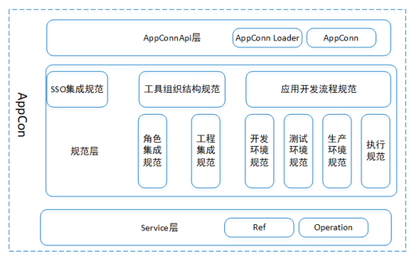
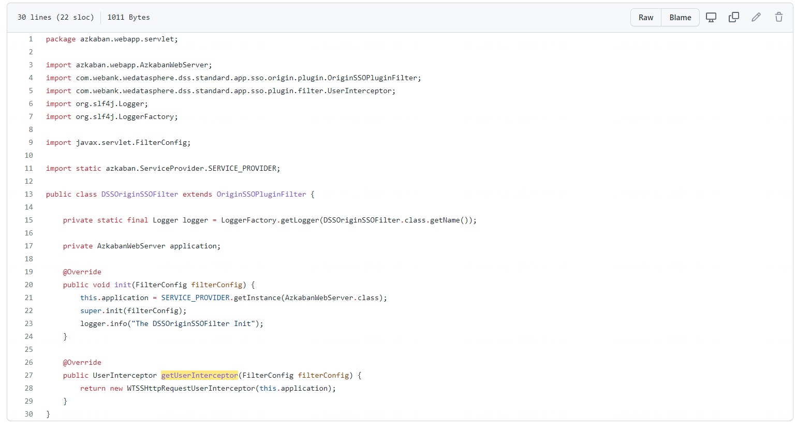
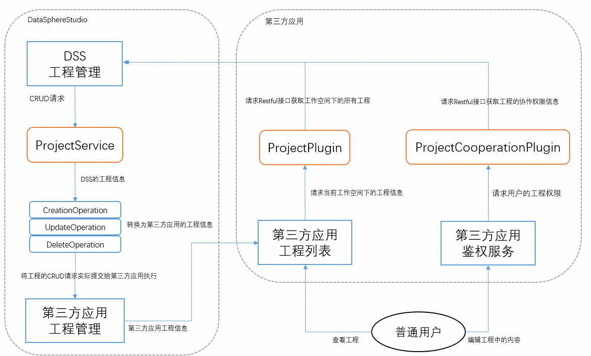

# AppConn 开发指南

## 一、前言

第三方系统通过实现一个 ```AppConn``` 来接入 DSS，DSS 提供了多种 ```AppConn``` 用于方便不同应用场景的第三方系统的快速接入。

以下是各种基础 ```AppConn``` 的详细介绍，每一种 AppConn 都代表了 DSS 框架抽象的一种能力：

- ```OnlySSOAppConn```。如果您的第三方系统只想与 DSS 完成 SSO 免登录跳转，则只需继承该 AppConn 即可。
- ```OnlyStructureAppConn```。如果您的第三方系统想与 DSS 统一组织结构，如：工程的统一创建、更新、删除等管理操作，角色权限管理的统一管理，则需继承该 AppConn。
- ```OnlyDevelopmentAppConn```。如果您的第三方系统想作为 DSS 工作流的一个节点集成进来，则需实现该 AppConn。
- ```OptionalAppConn```。该 AppConn 是 一个可选的非强制实现的 AppConn 规范。用于协助第三方 AppConn 提供一些特殊的 Operation 能力，这些 Operation 与 DSS 的框架逻辑无关，并不是 DSS 框架要求第三方 AppConn 需具备的能力。

在以上的基础 AppConn 之上，DSS为方便大家集成对接，提供了几个组合 AppConn，分别是：

- ```SchedulerAppConn```。该 AppConn 是 ```OnlySSOAppConn``` 和 ```OnlyStructureAppConn``` 的子类，用于将一条 DSS 工作流同步给第三方调度系统，补充 DSS 工作流的调度能力；如果您想对接其他调度系统，则需实现该 AppConn。
- ```SecondlyAppConn```。是 ```OnlySSOAppConn``` 和 ```OnlyStructureAppConn``` 的子类，表示第三方系统既想打通 SSO，又想打通组织结构。
- ```ThirdlyAppConn```。是 ```OnlySSOAppConn```、```OnlyStructureAppConn``` 和 ```OnlyDevelopmentAppConn``` 的子类，表示第三方系统既想打通 SSO 和组织结构，又想作为 DSS 工作流的一个节点集成进来。

您可以根据实际需要，选择对应的 ```AppConn``` 进行实现。

## 二、基础 AppConn 的详细介绍

```AppConn``` 的具体实现包含以下几个层面，第一层是 ```AppConn``` 层，第二层是 ```AppStandard``` 规范层，第三层是 ```Service``` 层，第四层是 ```Operation``` 层，主要的业务逻辑都是在 ```Operation``` 层实现的, 参数的传递统一采用的是 ```Ref``` 实现类。



### 2.1 OnlySSOAppConn —— 打通 SSO 免登录跳转

DSS 提供了 SSO 免登录跳转的核心 SSO Jar 包，第三方系统需引入该 SSO Jar 包，且在 Filter 中信任 DSS 用户，即可完成用户免登录跳转。

DSS SSO 免登录跳转的设计方案如下：


目前对接 DSS 的一级 SSO 免登录跳转规范大概有两种方式：一种是 Spring Web 应用的对接方式；另一种则是非 Spring Web 应用的对接方式。

#### 2.1.1 Spring Web 应用实现 DSS 一级规范

定义一个 ```Configuration```，如下图：

```java
@Configuration
public class DSSConfiguration {

    @Bean
    public FilterRegistrationBean<SSOPluginFilter> dssSSOFilter(@Autowired SSOPluginFilter ssoPluginFilter) { 
        FilterRegistrationBean<SSOPluginFilter> filter = new FilterRegistrationBean<>();
        filter.setName("dssSSOFilter");
        filter.setFilter(ssoPluginFilter); 
        // 指定优先级，顺序必须在第三方应用的用户登录判断Filter之前 
        filter.setOrder(-1); 
        return filter; 
    }
} 

```

请注意：如果以依赖注入的方式引入 ```@Autowired SSOPluginFilter ssoPluginFilter```，则需将 ```com.webank.wedatasphere``` 加入到 SpringBoot main class 的 ```@ComponentScan(basePackages=”com.webank.wedatasphere”)``` 之中；否则，请直接使用以下方式：
```java
@Configuration
public class DSSConfiguration {

    @Bean
    public FilterRegistrationBean<SSOPluginFilter> dssSSOFilter() { 
        FilterRegistrationBean<SSOPluginFilter> filter = new FilterRegistrationBean<>();
        filter.setName("dssSSOFilter");
        filter.setFilter(new SpringOriginSSOPluginFilter()); 
        // 指定优先级，顺序必须在第三方应用的用户登录判断Filter之前 
        filter.setOrder(-1); 
        return filter; 
    }
} 
```

#### 2.1.2 非 Spring Web 应用

需自己继承 ```OriginSSOPluginFilter```，并将该 filter 加入到 Web 容器之中，其顺序必须在第三方应用的用户登录判断 Filter 之前。

具体代码参考如下图所示：
https://github.com/WeBankFinTech/Schedulis/blob/branch-0.6.1/azkaban-web-server/src/main/java/azkaban/webapp/servlet/DSSOriginSSOFilter.java



#### 2.1.3 实现 UserInterceptor

请注意：不管是 Spring Web 应用，还是非 Spring Web 应用，都需要实现一个 ```UserInterceptor ```。

根据不同的场景，DSS 提供了以下的三种 ```UserInterceptor``` 次级接口：

- ```DSSInternalUserInterceptor```：如果第三方应用为 DSS 内部应用，则实现该接口；
- ```HttpRequestUserInterceptor```：如果第三方应用的用户登录信息(如：User 对象)，是存储在 cookies 里面，则需要实现该接口，该接口主要的目的是希望第三方系统将 user 写入到 ```HttpServletRequest``` 之中并返回，这样后面的 Filter 就能在 cookie 中检测到用户而直接放行，可参考 Schedulis 的实现：https://github.com/WeBankFinTech/Schedulis/blob/branch-0.6.1/azkaban-web-server/src/main/java/azkaban/webapp/servlet/WTSSHttpRequestUserInterceptor.java
- ```HttpSessionUserInterceptor```：如果第三方应用的用户登录信息(如：User 对象)，是存储在 HttpSession 里面，则需要实现该接口，该接口主要的目的是希望第三方系统将 user 写入到 ```HttpSession``` 之中，这样后面的 Filter 就能在 cookie 中检测到用户而直接放行；

请注意：**如果是 Spring Web 应用，还需将实现的 ```UserInterceptor``` 以 ```@Component``` 标识，以便 ```SpringOriginSSOPluginFilter``` 能够正常加载到该 ```UserInterceptor```。**

### 2.2 OnlyStructureAppConn —— 接入 DSS 组织结构规范

```OnlyStructureAppConn``` 要求用户必须返回一个 ```StructureIntegrationStandard``` 对象，该对象即为： DSS 组织结构规范。

用户可以直接继承 ```AbstractStructureIntegrationStandard```，其中包含了三个需要用户实现的 ```StructureService```，即：

- ```ProjectService```，工程集成规范。用于打通 DSS 工程与接入的第三方应用工具的工程体系，实现工程的协同管理。
- ```RoleService```，工程集成规范。该规范为预留规范，DSS 框架层暂未与这两个规范进行对接，用户直接返回 null 即可。
- ```AppStatusService```，第三方应用状态检查规范。该规范为预留规范，DSS 框架层暂未与这两个规范进行对接，用户直接返回 null 即可。

#### 2.2.1 工程集成规范

```ProjectService``` 实现了工程的统一创建、更新、删除和查重操作，工程规范架构如下图所示：



##### 2.2.1.1 StructureOperation 介绍

工程集成规范 ```ProjectService```，要求必须实现的 ```StructureOperation``` 如下：

- ```ProjectCreationOperation```，工程创建协议。
- ```ProjectUpdateOperation```，工程更新协议。
- ```ProjectDeletionOperation```，工程删除协议。
- ```ProjectSearchOperation```，工程查重协议。

以下先给出 ```ProjectCreationOperation``` 的接口定义，其他的 ProjectOperation 也提供了丰富的接口注释，这里不再一一贴出。

```java
    import com.webank.wedatasphere.dss.standard.app.structure.StructureOperation;
    import com.webank.wedatasphere.dss.standard.app.structure.project.ref.DSSProjectContentRequestRef;
    import com.webank.wedatasphere.dss.standard.app.structure.project.ref.ProjectResponseRef;
    import com.webank.wedatasphere.dss.standard.common.exception.operation.ExternalOperationFailedException;

    public interface ProjectCreationOperation<R extends DSSProjectContentRequestRef<R>>
            extends StructureOperation<R, ProjectResponseRef> {
    
        /**
         * 该方法会尝试请求第三方应用工具创建一个与 DSS 工程一对一关联的第三方 refProject。
         * 如果创建成功，请返回一个包含了第三方应用工具的工程 ID（命名为 refProjectId）的 ProjectResponseRef，
         * 以便 DSS 接下来可以使用 refProjectId 来管理第三方应用工具的这个工程（命名为 refProject）。 
         * <br>
         * 返回的 refProjectId 是其他 ProjectOperation 能够操作这个第三方应用工具的工程的基础。DSS 在调用其他
         * ProjectOperation 时，会将该 refProjectId 作为方法参数传入，以便用户能正常找到对应的 refProject 进行相应操作。
         * @param projectRef 包含了 DSS 的工程信息.
         * @return 返回一个包含了 refProjectId 的 ProjectResponseRef
         * @throws ExternalOperationFailedException 如果创建过程中发生异常，请抛出该异常。
         */
        ProjectResponseRef createProject(R projectRef) throws ExternalOperationFailedException;
    
    }
```

从上可以看出，```ProjectCreationOperation``` 是一个带了 ```<R extends DSSProjectContentRequestRef<R>>``` 的泛型接口，要求用户的实现类必须指定具体的泛型。

请注意：每个 ```ProjectOperation``` 接口都是泛型接口，用户在实现时必须按要求指定合适的泛型类，以便 DSS 框架层能够正常找到该 ```ProjectRequestRef``` 成功完成调用。

推荐用户在实现对应的 ```ProjectOperation``` 时，先继承 ```AbstractStructureOperation```，下面是 ```VisualisAppConn``` 的一个例子：

```java
    public class VisualisProjectCreationOperation extends AbstractStructureOperation<DSSProjectContentRequestRef.DSSProjectContentRequestRefImpl, ProjectResponseRef>
            implements ProjectCreationOperation<DSSProjectContentRequestRef.DSSProjectContentRequestRefImpl> {
    }
```

##### 2.2.1.2 StructureOperation 的 ProjectRequestRef 体系介绍

这里重点介绍一下各 ```ProjectOperation``` 的方法入参 ```ProjectRequestRef``` 和 返回值 ```ProjectResponseRef``` 体系。

根据需要，```ProjectRequestRef``` 主要有以下几个基础定义：

- ```DSSProjectContentRequestRef```，包含了 DSS 的工程信息，如：```DSSProject```对象、DSS 工程的权限信息（主要是 accessUsers，editUsers，releaseUsers）。主要是提供给 ```ProjectCreationOperation``` 和 ```ProjectUpdateOperation``` 在对第三方应用的工程进行创建和更新时使用的。
- ```RefProjectContentRequestRef```，包含了 第三方应用工具的工程 ID 信息，如：```refProjectId```，方便用户能正常找到第三方应用工具对应的 refProject 进行相应操作，如：```ProjectDeletionOperation``` 、 ```ProjectUpdateOperation``` 和 ```ProjectSearchOperation``` 在删除、更新和查找时进行使用。
- ```ProjectUpdateRequestRef```，是 ```DSSProjectContentRequestRef``` 和 ```RefProjectContentRequestRef``` 的子类，第三方应用工具在更新工程时，既需要 DSS 工程的相关信息，也需要 refProject 的 ID 信息。

上面的各个 ```ProjectRequestRef``` 都已在对应的接口中提供了具体的实现类，您在实现对应的 ```ProjectOperation``` 时，可以直接引入使用，如 ```DSSProjectContentRequestRef.DSSProjectContentRequestRefImpl```。

##### 2.2.1.3 StructureOperation 的 ProjectResponseRef 体系介绍

而 ```ProjectResponseRef``` 则相对简单许多，只要求用户返回 ```refProjectId```，DSS 框架会存储该 ```refProjectId``` 到数据库，方便在调用各 ```ProjectOperation``` 时，能按需传入 ```refProjectId```。

其中，也只有 ```ProjectCreationOperation``` 和 ```ProjectSearchOperation``` 要求返回一个包含了 ```refProjectId``` 的 ```ProjectResponseRef```，而 ```ProjectUpdateOperation``` 和 ```ProjectDeletionOperation``` 只要求返回一个 ```ResponseRef```，即只需告知 DSS 框架删除和更新操作是否成功即可。 

您还可以参考 VisualisAppConn 的实现方式：[请点我查看](https://github.com/WeDataSphere/DataSphereStudio/tree/dev-1.1.0/dss-appconn/appconns/dss-visualis-appconn/src/main/java/com/webank/wedatasphere/dss/appconn/visualis/project)

### 2.3 OnlyDevelopmentAppConn —— 接入 DSS 开发流程规范

```OnlyDevelopmentAppConn``` 要求用户必须返回一个 ```DevelopmentIntegrationStandard``` 对象，该对象即为： DSS 开发流程规范。

用户可以直接继承 ```AbstractDevelopmentIntegrationStandard```，其中包含了五个需要用户实现的 ```DevelopmentService```，即：

- ```RefCRUDService```，Job 管理规范，主要用于管理第三方应用工具的 Job（命名为 ```refJob```）。
- ```RefExecutionService```，Job 执行规范，主要用于执行第三方应用工具的 Job。
- ```RefExportService```，Job 导出规范，主要用于导出第三方应用工具的 Job。
- ```RefImportService```，Job 导入规范，主要用于导入第三方应用工具的 Job。
- ```RefQueryService```，Job 查询规范，主要用于打开第三方应用工具的 Job 的页面。

目前主要是 DSSOrchestrator 需要使用开发流程规范，如：DSS工作流，各第三方应用工具的工作流节点的增删改查操作、导入导出操作，节点实时执行，以及 打开第三方节点前端页面 等操作。

##### 2.3.1.1 DevelopmentService 介绍

由于每一个 ```DevelopmentService``` 的架构设计方式完全相同，这里详细介绍一下 Job 管理规范 ```RefCRUDService```。

Job 管理规范 ```RefCRUDService``` 要求必须实现的 ```DevelopmentOperation``` 如下：

- ```RefCreationOperation```，第三方应用工具的 Job（命名为 ```refJob```）的创建协议。
- ```RefCopyOperation```，第三方应用工具的 Job（命名为 ```refJob```）的复制协议。
- ```RefUpdateOperation```，第三方应用工具的 Job（命名为 ```refJob```）的更新协议。
- ```RefDeletionOperation```，第三方应用工具的 Job（命名为 ```refJob```）的删除协议。

以下先给出 ```RefCreationOperation``` 的接口定义，其他的 ```DevelopmentOperation``` 也提供了丰富的接口注释，这里不再一一贴出。

```java
    import com.webank.wedatasphere.dss.standard.app.development.ref.DSSJobContentRequestRef;
    import com.webank.wedatasphere.dss.standard.app.development.ref.RefJobContentResponseRef;
    import com.webank.wedatasphere.dss.standard.common.exception.operation.ExternalOperationFailedException;
    
    public interface RefCreationOperation<K extends DSSJobContentRequestRef<K>>
            extends DevelopmentOperation<K, RefJobContentResponseRef> {
    
        /**
         * 该方法会尝试请求第三方应用工具，在 refProject 下创建一个与 DSS Job 一对一关联的第三方 refJob。
         * 如果创建成功，请返回一个包含了第三方应用工具的 job ID（命名为 refJobId）的 RefJobContentResponseRef，
         * 以便 DSS 接下来可以使用 refJobId 来管理第三方应用工具对应 refProject 工程下的 refJob。 
         * <br>
         * 返回的 refJobId 是其他 DevelopmentOperation 能够操作这个第三方应用工具的 Job 的基础。DSS 在调用其他
         * DevelopmentOperation 时，会将该 refJobId 作为方法参数传入，以便用户能正常找到对应的 refJob 进行相应操作。
         * 
         */
        RefJobContentResponseRef createRef(K requestRef) throws ExternalOperationFailedException;
    
    }

```

这里重点介绍一下 ```RefQueryJumpUrlOperation``` 和 ```RefExecutionOperation``` 的实现参考。

下面是一个 ```RefQueryJumpUrlOperation``` 的实现参考：

```java
    public class TestRefQueryOperation 
        extends AbstractDevelopmentOperation<ThirdlyRequestRef.QueryJumpUrlRequestRefImpl, QueryJumpUrlResponseRef>
        implements RefQueryJumpUrlOperation<ThirdlyRequestRef.QueryJumpUrlRequestRefImpl, QueryJumpUrlResponseRef> {
        
        public QueryJumpUrlResponseRef query(ThirdlyRequestRef.QueryJumpUrlRequestRefImpl ref) throws ExternalOperationFailedException {
            String jumpUrl = ref.getSSOUrlBuilderOperation().setReqUrl(getBaseUrl()).redirectTo(getBaseUrl() + "/jobUi/1")
                            // nodeId 主要是提供给 “先打开，后创建” 类型的 工作流节点使用的，具体可参考 DSS工作流如何新增工作流节点#1.2 第三方节点类型的特殊对接
                            .addQueryParameter(QueryJumpUrlConstant.NODE_ID.getKey(), QueryJumpUrlConstant.NODE_ID.getValue())
                            .addQueryParameter("projectId", ref.getProjectRefId().toString())
                            // 第三方系统对应的 refJob 的 id 值，这里的 "id" 只是一个示例，第三方系统不一定为该名称，取决于 RefCreationOperation 
                            // 带回来的 refJobContent 值。 
                            .addQueryParameter("id", String.valueOf(ref.getRefJobContent().get("id")))
                            .getBuiltUrl();
            return QueryJumpUrlResponseRef.newBuilder().setJumpUrl(jumpUrl).success();
        }
    }
```

下面是一个 ```RefExecutionOperation``` 的实现参考：

```java
    public class TestRefExecutionOperation 
        extends LongTermRefExecutionOperation<RefExecutionRequestRef.RefExecutionProjectWithContextRequestRef>
        implements Killable {
        
        /**
         * 异步提交给第三方 AppConn，请求执行该 refJob。
         * 通常情况下，第三方 AppConn 会返回一个 executionId，请将该 executionId 放入 {@code RefExecutionAction}之中，
         * 以便后面的 state()、 result() 和 kill() 方法可通过该 RefExecutionAction 中的 executionId 请求第三方 AppConn 进行操作。
         * @return 包含了 executionId 的 RefExecutionAction
         * @throws ExternalOperationFailedException 提交失败时抛出该异常
         */    
        @Override
        protected RefExecutionAction submit(RefExecutionRequestRef.RefExecutionProjectWithContextRequestRef requestRef) throws ExternalOperationFailedException {
            // submitTo 是伪代码，表示向第三方系统提交请求，获取 executionId
            String executionId = submitTo(requestRef);
            // 请定义一个 AbstractRefExecutionAction 的实现类，用于存储您想要的额外信息
            AbstractRefExecutionAction action = new AbstractRefExecutionAction(){};
            action.setExecutionRequestRefContext(requestRef.getExecutionRequestRefContext());
            action.setId(id);
            return action; 
        }
    
        /**
         * 获取已提交给第三方 AppConn 的 refJob 的状态。
         * 您也可以在该方法内，既获取 refJob 的状态，同时也获取 refJob 的执行进度，然后通过调用
         * RefExecutionAction.getExecutionRequestRefContext().updateProgress() 方法更新该 refJob 的执行进度，
         * 以便 DSS 能够直接在前端展示出该 refJob 的实时进度信息。
         * @param action 包含了 executionId 的 RefExecutionAction
         * @return 返回 refJob 的状态
         * @throws ExternalOperationFailedException 获取状态失败时抛出该异常
         */
        @Override
        public RefExecutionState state(RefExecutionAction action) throws ExternalOperationFailedException {
            // getStateFrom 是伪代码，表示向第三方系统请求 executionId 的状态
            String state = getStateFrom(action);
            // toRefExecutionState 是伪代码，将第三方系统的状态，翻译成 RefExecutionState
            RefExecutionState state = toRefExecutionState(state);
            // (非必须) 您也可以同时获取 refJob 的执行进度并进行更新
            // (非必须) getProgressFrom 是伪代码，表示向第三方系统请求 executionId 的进度
            long progress = getProgressFrom(action);
            // (非必须) 更新进度
            action.getExecutionRequestRefContext().updateProgress(progress);
            return state;
        }

        /**
         * 获取已提交给第三方 AppConn 的 refJob 的结果。
         * 请注意：该方法只在 state() 方法返回的状态为成功时才会被调用。
         * @param action 包含了 executionId 的 RefExecutionAction
         * @return 返回 refJob 的结果
         * @throws ExternalOperationFailedException 获取结果失败时抛出该异常
         */
        @Override
        public ExecutionResponseRef result(RefExecutionAction action) throws ExternalOperationFailedException {
            // 请先确认：executionId 的任务是否有结果集？如果有结果集，您是否想将该结果集提供给下游工作流节点使用？
            // 如果都不想，则只需简单返回结果即可，如下所示：
            if(isSucceed) {
                return ExecutionResponseRef.newBuilder().success();
            } else {
                return ExecutionResponseRef.newBuilder().setException(t).build();
            }
            // 如果都想，则需将结果集写入，如下所示：
            // 请先确认结果集类型，具体可参考 ExecutionRequestRefContext 所支持的结果集类型
            // 我们这里以 表格类型 的结果集进行举例
            ResultSetWriter resultSetWriter = null;
            try {
                resultSetWriter = action.getRequestRef().getExecutionRequestRefContext().createTableResultSetWriter();
                // getColumnsFrom 是伪代码，用于获取所有的字段信息
                List<Column> columns = getColumnsFrom(action);
                resultSetWriter.addMetaData(new TableMetaData(columns.toArray(new Column[0])));
                // getDataFrom 是伪代码，用于获取所有的表格数据
                List<List<Object>> resultList = getDataFrom(action);
                if(resultList != null && !resultList.isEmpty()) {
                    resultList.forEach(list -> resultSetWriter.addRecord(new TableRecord(list.toArray())));
                }
                resultSetWriter.flush();
                action.getRequestRef().getExecutionRequestRefContext().sendResultSet(resultSetWriter);
            } catch (Exception e) {
                LOGGER.error("fetch result failed!", e);
                // 为了方便排查错误，您也可以用以下的方法打印更多的信息
                action.getRequestRef().getExecutionRequestRefContext().appendLog("更加丰富的日志信息。");
                throw new ExternalOperationFailedException(90176, "fetch result failed!", e);
            } finally{
                IOUtils.closeQuietly(resultSetWriter);
            }
            return ExecutionResponseRef.newBuilder().success();
        }

        /**
         * 请求 kill 第三方 AppConn 的 refJob。
         * 请注意：如果 refJob 已经执行完成（成功或失败），也请返回 true。
         * @param action 包含了 executionId 的 RefExecutionAction
         * @return 返回 kill refJob 的结果，true 为 kill 成功，false 为 kill 失败
         */
        @Override
        public boolean kill(RefExecutionAction action) {
            // killFrom 是伪代码，表示向第三方系统请求 kill executionId
            return killFrom(action);
        }

    }
```

需要注意的是，所有的 ```DevelopmentOperation``` 也都是泛型接口，用户在实现时必须按要求指定合适的泛型类，以便 DSS 框架层能够正常找到该 ```DevelopmentRequestRef``` 成功完成调用。

推荐用户在实现对应的 ```DevelopmentOperation``` 时，先继承 ```AbstractDevelopmentOperation```，下面是 ```VisualisAppConn``` 的一个例子：


##### 2.3.1.2 DevelopmentRequestRef 介绍

```DevelopmentRequestRef``` 体系较为复杂，这里先从基础定义开始介绍：

- ```DSSJobContentRequestRef```，包含了 DSS 工作流节点的信息，```dssJobContent``` 存储了该工作流节点的基本信息，所有的 key 已被 ```DSSJobContentConstant``` 收录。
- ```RefJobContentRequestRef```，包含了 第三方应用工具的 refJob ID 信息，如：```refJobContent```，方便用户能正常找到第三方应用工具对应的 refJob 进行相应操作，如：```RefUpdateOperation``` 、 ```RefDeletionOperation```等， 在删除、更新和查找时进行使用。
- ```DSSContextRequestRef```，包含了 DSS 工作流的 contextId 信息。
- ```ProjectRefRequestRef```，包含了 第三方应用工具的 refProjectId。
- ```UpdateRequestRef```，为 ```DSSJobContentRequestRef``` 和 ```RefJobContentRequestRef``` 的子接口。
- ```CopyRequestRef```，为 ```RefJobContentRequestRef``` 的子接口，且包含了拷贝的工作流版本信息。
- ```ImportRequestRef```，为 ```CopyRequestRef``` 的子接口，包含的 resourceMap ，表示该工作流节点的元数据文件，通过该文件可还原工作流节点。
- ```QueryJumpUrlRequestRef```，包含了 ```SSOUrlBuilderOperation```，可协助封装出第三方系统 refJob 对应的前端页面的 URL。

我们也为以上的每个 ```DevelopmentRequestRef``` 提供了具体的实现类，目前有两个实现体系：```OnlyDevelopmentRequestRef``` 和 ```ThirdlyRequestRef```。

当您翻读源码，可以看到 ```OnlyDevelopmentRequestRef``` 和 ```ThirdlyRequestRef``` 里面定义了完全相同的子类，
唯一的区别在于，```OnlyDevelopmentRequestRef``` 是给那些不具备项目概念（即其对应的 ```AppConn``` 没有实现 ```OnlyStructureAppConn```）的第三方 ```AppConn``` 使用的，
而 ```ThirdlyRequestRef``` 是给那些具备项目概念的第三方 ```AppConn``` 使用的。

需要注意的是， ```ThirdlyRequestRef``` 和 ```OnlyDevelopmentRequestRef``` 的各 ```DevelopmentRequestRef``` 实现类也按需定义了各个场景的实现类，您可按照您的实际需要，选择相应的实现类填充到各 ```DevelopmentOperation``` 所要求指定的泛型。

这里举一个 ```RefCreationOperation``` 的例子。

由于 Visualis 具备项目的概念，且 Visualis 打通了 DSS 工作流的上下文能力（即上游节点的结果集可直接作为 Visualis widget 的 view 进行可视化图表分析，因此 ```VisualisRefCreationOperation``` 的定义如下：

```java
public class VisualisRefCreationOperation
        extends VisualisDevelopmentOperation<ThirdlyRequestRef.DSSJobContentWithContextRequestRef, RefJobContentResponseRef>
        implements RefCreationOperation<ThirdlyRequestRef.DSSJobContentWithContextRequestRef> {
            // 省略其内部具体的实现方法...
        }
```

```VisualisRefCreationOperation``` 选择了 ```ThirdlyRequestRef.DSSJobContentWithContextRequestRef``` 作为 ```RefCreationOperation<K extends DSSJobContentRequestRef<K>>``` 要求指定的泛型类 K。

以下是 ```ThirdlyRequestRef.DSSJobContentWithContextRequestRef``` 的定义：

```java
class DSSJobContentWithContextRequestRef extends DevelopmentRequestRefImpl<DSSJobContentWithContextRequestRef>
            implements DSSJobContentRequestRef<DSSJobContentWithContextRequestRef>, DSSContextRequestRef<DSSJobContentWithContextRequestRef>,
            ProjectRefRequestRef<DSSJobContentWithContextRequestRef> {}
```

可以看到，`DSSJobContentWithContextRequestRef` 还实现了 `DSSContextRequestRef` （代表了上下文能力） 和 `ProjectRefRequestRef` （代表了工程能力）两个接口，`DSS 框架层` 发现 `该泛型类` 希望具备上下文和工程能力时，
在创建 `DSSJobContentWithContextRequestRef` 时，会自动将上下文信息和工程信息 `set` 进来，以便 `VisualisRefCreationOperation` 可以正常使用这两个能力。

##### 2.3.1.3 DevelopmentResponseRef 介绍

```DevelopmentResponseRef``` 体系较为简单，具体如下：

- ```RefJobContentResponseRef```，与 ```RefJobContentRequestRef``` 对应，包含了 第三方应用工具的 refJob ID 信息，如：```refJobContent```，方便用户能正常找到第三方应用工具对应的 refJob 进行相应操作。
- ```ExportResponseRef```，与 ```ImportRequestRef``` 对应，这里的 resourceMap，指第三方应用系统将 refJob 导出的元数据文件，通过该文件可还原工作流节点。
- ```QueryJumpUrlResponseRef```，返回一个 jumpUrl，用于当前端双击 DSS 工作流节点时，前端可通过该 jumpUrl 跳转到第三方系统 refJob 对应的前端页面。


### 2.4 OptionalAppConn —— 可选的非强制实现的 AppConn 规范

用于协助第三方 `AppConn` 提供一些特殊的 `Operation` 能力，这些 `Operation` 与 DSS 的框架逻辑无关，并不是 DSS 框架要求第三方 `AppConn` 需具备的能力。

但是 DSS 内嵌的一些应用工具（在 `dss-apps` 目录下）可能会使用某些接入进来的外部 AppConn，并希望这些第三方外部 AppConn 具备一些特殊能力。

例如： `DolphinSchedulerAppConn` 提供的 `DolphinSchedulerTokenGetOperation`， 用于获取 DolphinScheduler 用户的 `token`。

用户如果想使用 `OptionalAppConn`，需在其对应的 AppConn 类上引入 `OptionalAppConn`，例如：

```java
public class DolphinSchedulerAppConn extends AbstractSchedulerAppConn implements OptionalAppConn {
    // 省略其内部具体的实现方法...
}
```

只需简单引入即可，接下来用户只需直接编写相关的 `OptionalOperation` 实现类，DSS 框架会自动扫描整个 AppConn jar 包，并将这些 `OptionalOperation` 自动注册到其 AppConn 之中。

我们强烈推荐用户继承 `AbstractOptionalOperation` 类。

最后简单介绍一下 `OptionalOperation` 和 `RefQueryOperation` 的区别：

- `OptionalOperation`，是第二级规范 `OnlyStructureAppConn` 提供的，用于向第三方外部系统发起一些额外的系统请求，或获取第三方外部系统的一些额外信息。
- `RefQueryOperation`，是第三级规范 `OnlyDevelopmentAppConn` 提供的，用于获取第三方外部系统的 refJob 的额外信息。

因此，`RefQueryOperation` 是专门为第三级规范——开发流程规范服务的，一般只会被具体的 DSSOrchestrator (例如：DSS 工作流) 调用。

而 `OptionalOperation` 的定位，是提供灵活的扩展能力，方便用户向第三方外部系统发起一些额外的系统请求。它没有任何使用限制，既可以被 DSS 内嵌的应用工具（在 `dss-apps` 目录下）使用，也可以被具体的 DSSOrchestrator 使用。