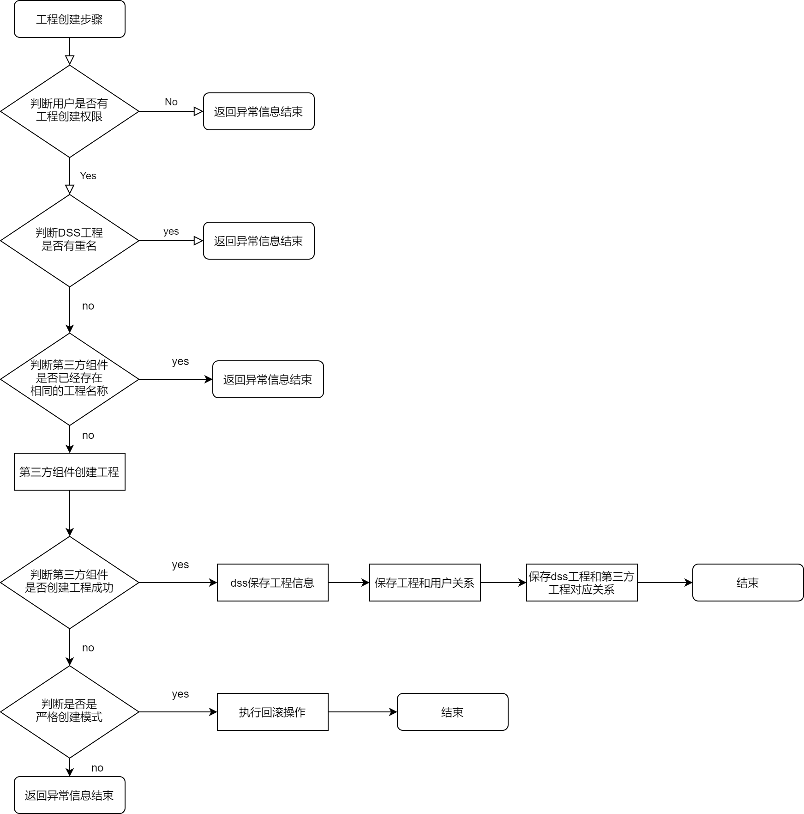

# DSS 工程设计


在实际的开发生产中，工程往往被用来管理开发一类数据应用，工程可以是一个实际的一类数据应用，包括工作流，单任务等，每个工作空间下的工程互相隔离。


## 1、架构设计

- DSS本身可以创建和管理工程。包括创建、查看、修改、删除等功能。同时DSS提供工程集成规范完成与外部组件的对接操作。
- DSS的工程通过工程集成规范，与外部系统的工程（或同级别的实体）进行同步创建和互相绑定。
- 外部系统通过工程集成规范，获取用户在DSS对应的工程，完成对底层实体的统一管理。
- 外部系统通过工程集成规范，获取用户在DSS拥有的工程权限，进一步限制原生工程的操作权限。


### 2.1.1、工程创建

简要流程说明：创建DSS工程 》创建第三方应用工程 》保存工程与用户权限关系

流程图：



### 2.1.2、工程编辑

简要流程说明： 编辑用户权限关系 》编辑第三方工程信息 》编辑DSS工程基本信息


流程图：


### 2.1.3、工程删除

简要流程说明：判断是否有删除权限 》删除第三方应用工程 》删除DSS工程

### 

## 3、数据库表结构设计

```
--dss工程基础信息表
dss_project:
 id                      
 name                    
 source                  
 description             
 user_id                 
 username                
 workspace_id            
 create_time             
 create_by               
 update_time             
 update_by               
 org_id                  
 visibility              
 is_transfer             
 initial_org_id          
 isArchive               
 pic                     
 star_num                
 product                 
 application_area        
 business                
 is_personal             
 create_by_str           
 update_by_str           
 dev_process             
 orchestrator_mod        
 visible
 
 --dss工程与用户权限关系表
 dss_project_user:
  id                 
  project_id         
  username           
  workspace_id       
  priv  
  last_update_time 
  
 --第三方应用工程与dss工程关系表
 dss_appconn_project_relation:  
  id                           
  project_id                   
  appconn_instance_id          
  appconn_instance_project_id

```


